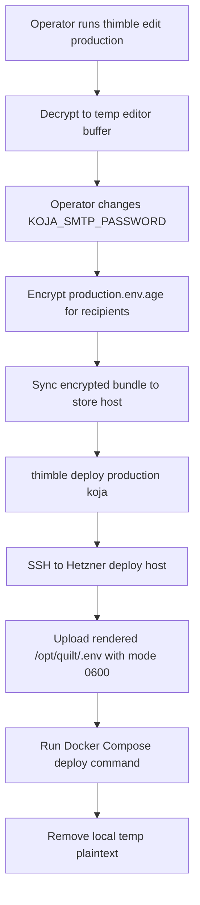

# Thimble: Lightweight Secrets Management

> **Status: original design doc, retained for context.** The implementation has
> diverged in two specific ways: the manifest is `secrets/thimble.json` (not
> `thimble.toml`), and bundles live under `secrets/<application>/<environment>.env.age`
> (not flat under `secrets/`). The CLI takes both `<application>` and
> `<environment>` as positional args. The [README](README.md) is the
> authoritative reference for current behavior; this document is preserved for
> the original problem framing, non-goals, and design principles. See
> [TAXONOMY.md](TAXONOMY.md) for canonical terms.

Thimble is a small-team secrets tool for Koja-style deployments: one or a few
operators, one or a few Hetzner hosts, Docker Compose, and no appetite for a
full Vault-shaped service before the product needs one.

The goal is not to invent cryptography. The goal is to make the safe path feel
as simple as editing `.env`, while using proven primitives under the hood.

## Problem

The current deployment flow keeps production secrets in plaintext `.env` files
on an operator machine and on the Hetzner VPS. That is easy to understand, but
it has weak answers for:

- adding or removing operators
- restoring secrets from source control
- rotating values deliberately
- avoiding plaintext drift across laptops and servers
- handing deployment work to agents without showing them secrets

SOPS, Vault, OpenBao, and Infisical all solve pieces of this, but they are
heavier than the current alpha needs. Thimble should cover the boring 80% with
a small CLI and an intentionally narrow mental model.

## Non-Goals

- Do not implement cryptography.
- Do not become a hosted secrets service on day one.
- Do not require Kubernetes.
- Do not require a central database.
- Do not manage product user API keys yet.
- Do not promise protection after a production host is fully compromised.

## Design Principles

- **File-first:** encrypted secrets are ordinary files; any byte-faithful
  transport (rsync, object storage, scp) can move them between peers.
- **Peer-capable:** operators and deploy hosts can sync encrypted bundles
  without a required central server.
- **Recipient-based:** access is controlled by public encryption recipients,
  not by copying plaintext around.
- **Plaintext is brief:** decrypt only for the command that needs it, preferably
  to memory or a `0600` temp file.
- **Deployment-aware:** Docker Compose `.env` remains a first-class output.
- **Agent-safe by default:** agents can inspect schema, keys, and metadata
  without seeing decrypted values unless explicitly authorized.

## Core Model

Thimble manages environments. An environment is a named encrypted secret set,
plus metadata describing who can decrypt it and where it can be deployed.

```text
secrets/
  thimble.toml
  production.env.age
  staging.env.age
```

Example `thimble.toml`:

```toml
[environment.production]
format = "dotenv"
file = "production.env.age"
recipients = [
  "age1operator...",
  "age1deployhost..."
]

[environment.production.deploy.koja]
host = "deploy@koja.dev"
path = "/opt/quilt/.env"
mode = "0600"
restart = "docker compose --env-file /opt/quilt/.env -f /opt/quilt/src/quilt/deploy/docker/docker-compose.prod.yml up -d"
```

## CLI Sketch

```sh
thimble init production
thimble recipient add production alice age1...
thimble recipient add production deploy@koja.dev age1...

thimble set production POSTGRES_PASSWORD
thimble set production KOJA_SMTP_PASSWORD
thimble edit production
thimble show production --keys

thimble render production --format dotenv
thimble deploy production koja
thimble rotate production KOJA_SMTP_PASSWORD
```

## Peer-to-Peer Shape

Peer-to-peer is interesting because Thimble does not need to be highly
available. The encrypted bundle is the durable object. Any authorized peer can
hold, sync, and redeploy it.

Peers can be:

- an operator laptop
- a deploy host
- an offline backup location
- a future agent workstation with limited permissions

The simplest sync mode is rsync over ssh; pick whatever your team already
uses. A later mode could use direct peer exchange:

```sh
thimble peer invite production alice-laptop
thimble peer sync production deploy@koja.dev
thimble peer pull production alice-laptop
```

In that model, peers exchange only encrypted bundles and recipient metadata.
There is no central Thimble server to fail over. Conflict handling can start
simple: reject concurrent edits unless the encrypted bundle version matches.

## Example Workflow



## Deployment Flow For Koja

Day one can preserve the current Compose flow:

1. Thimble decrypts `production.env.age` locally.
2. Thimble writes a local temp `.env` with `0600`.
3. Thimble copies it to `deploy@koja.dev:/opt/quilt/.env`.
4. Thimble runs the existing deploy script.
5. Thimble deletes local plaintext.

Later, if the deploy host has its own age identity, Thimble can upload the
encrypted bundle and decrypt on the host immediately before Compose runs. That
reduces local plaintext transfer but still leaves runtime secrets readable by
the host, which is inherent to the application needing them.

## Security Notes

- Use `age` or another audited recipient-based encryption tool.
- Never create custom encryption formats unless wrapping an audited primitive.
- Use atomic writes for encrypted bundle updates.
- Avoid printing secret values to stdout by default.
- Redact values in logs, diffs, error messages, and agent-visible output.
- Keep a recovery recipient offline.
- Treat deploy hosts as powerful: anything the application can read, a root
  attacker on the host can probably read too.

## Open Questions

- Should Thimble be a standalone CLI or a tiny subcommand inside Koja tooling?
- Should deploy hosts be decryption recipients from day one?
- Should the encrypted format be dotenv, JSON, or both?
- Should the first implementation use `age` directly or shell out to SOPS with
  a simpler UX wrapper?
- How should agents request a secret-dependent operation without seeing the
  decrypted secret?
- How much audit belongs in the transport's history (commit log, object
  storage versioning) versus Thimble's own append-only audit log?

## First Implementation Slice

Build the smallest useful version:

1. `thimble init <env>`
2. `thimble set <env> <KEY>`
3. `thimble render <env> --format dotenv`
4. `thimble deploy <env> <target>`

The acceptance test is practical: replace the current manual
`~/quilt/.env -> /opt/quilt/.env` copy with Thimble while leaving the existing
Docker Compose deployment unchanged.
